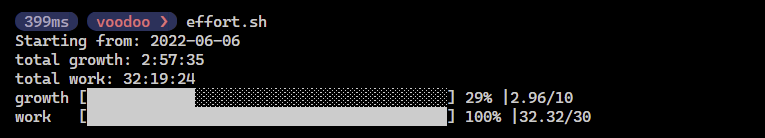

## Time spent in goals

This little script let you get the time you spent in certain projects.
It use weekly report toggl api to obtain the data you tracked during the last week.
It will give you an overview of how much dedication you have done according to the hours you set as goals.

## Doing requests to toggl api

You need to fill all the configuration expected in the .env file.
I created `.env_to_be_set` file, so you could start modifying it and when you are done you could rename it to `.env`

## Invoking the script

The script is using node. To use it first install the dependencies and then invoke the script.
There are 2 ways to do this:

```node one.js```

```effort.sh```

I created the latter so you could reference this file in any directory by adding it to the path.


## Examples
- 2 projects called growth and work with 10 and 30 hours goals respectively

